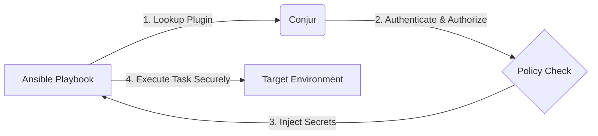

# 🔐 Ansible Integration with Conjur (CLI Demo)

This repository demonstrates a secure, Zero-Trust approach to dynamic secret retrieval using Ansible and CyberArk Conjur. It eliminates hardcoded credentials in playbooks and ensures secrets are fetched at runtime.

## 🏗️ Architecture Overview


This demo supports integration with Ansible version 2.8 and up:
- For **Ansible 2.8**, the demo uses: [ansible-conjur-host-identity](https://github.com/cyberark/ansible-conjur-host-identity)
- For **Ansible 2.9+**, the demo uses: [CyberArk Ansible Conjur Collection](https://galaxy.ansible.com/cyberark/conjur)

---

## 1. Prerequisites Installation

If needed, install Ansible on your control node:
```bash
scripts/01-install-ansible.sh
```

Install the appropriate Conjur plugin/collection for your Ansible version. The script will automatically detect your version and install the correct dependency:
```bash
scripts/02-install-plugin.sh
```

---

## 2. Loading Conjur Policies

To demonstrate proper Role-Based Access Control (RBAC) and the principle of least privilege, policies are divided into **Base** (Infrastructure) and **App** (Application/Secrets) configurations.

### Option A: Conjur Enterprise (On-Premise)

1. **Login as admin and load the base policy:**
   ```bash
   conjur login -i admin
   conjur policy update -b root -f policies/onprem-base.yml | tee -a base.log
   conjur logout
   ```
2. **Login as the newly created Ansible admin and load the app policy:**
   *(Use the API key for `ansible-admin01` retrieved from `base.log`)*
   ```bash
   conjur login -i ansible-admin01
   conjur policy update -b data/ansible -f policies/app.yml | tee -a app-policy.log
   ```

### Option B: Conjur Cloud

1. **Login as your Cloud admin and load the base policy:**
   ```bash
   conjur login -i <username>
   conjur policy update -b data -f policies/cloud-base.yml | tee -a base.log
   conjur logout
   ```
2. **Login as the Ansible admin and load the app policy:**
   *(Use the API key for `ansible-admin01` retrieved from `base.log`)*
   ```bash
   conjur login -i ansible-admin01
   conjur policy update -b data/ansible -f policies/app.yml | tee -a app-policy.log
   ```

---

## 3. Populate Conjur Variables

Generate and inject secure random values into the newly created Conjur variables (`db_password`, `api_key`, `ssh_key`):
```bash
scripts/03-populate-variables.sh | tee -a populate.log
```
*Note: Ensure you are still logged into the Conjur CLI as `ansible-admin01` before running this script.*

---

## 4. Execution

**Security Best Practice:** We use environment variables for secure execution to avoid committing sensitive connection details to source control.

1. **Configure your environment:**
   Copy the example environment file and fill in your specific Conjur details (URL, Account, API Key).
   ```bash
   cp .env.example .env
   vi .env
   ```

2. **Run the playbook:**
   ```bash
   scripts/04-run-book.sh
   
```

---

## 🛠️ Troubleshooting

### Conjur Cloud: Certificate Verification Error
If you receive an SSL/TLS verification error when running the playbook against Conjur Cloud:
1. Ensure the `CONJUR_CERT_FILE` variable is either commented out or removed from your `.env` file.
2. Update the Python trust store:
   ```bash
   python3 -m pip install --upgrade certifi
   ```

### macOS: "A worker was found in a dead state"
If Ansible crashes on a Mac with an `objc_initializeAfterForkError`:
This is due to high Sierra security changes breaking Python's `fork()`. Fix it by exporting this environment variable before running the playbook:
```bash
export OBJC_DISABLE_INITIALIZE_FORK_SAFETY=YES
```
