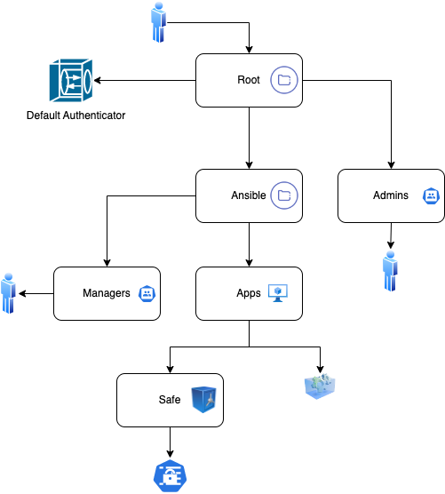

# Conjur policies for Ansible integration

This demo demonstrates secure secrets management for Ansible playbooks using CyberArk Conjur.

## Prerequisites
- Conjur Enterprise or OSS instance running.
- Ansible installed on the control node.
- Conjur CLI configured and authenticated.

## Instructions
1. Load the organization policies into Conjur (see diagram).
2. Configure Ansible to use the Conjur lookup plugin or Summon.
3. Execute the playbook to retrieve secrets dynamically.

The below diagram describes the organization we are loading into Conjur.

