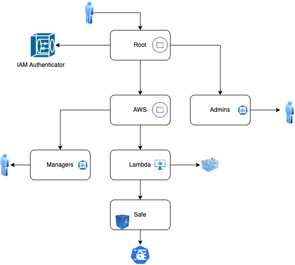

# Conjur policies for Lambda IAM Role authentication

This demo explains how to authenticate an AWS Lambda function to CyberArk Conjur using native AWS IAM Roles.

## Prerequisites
- Conjur Enterprise or OSS instance running.
- AWS Account with permissions to create Lambda functions and IAM roles.
- AWS IAM Authenticator enabled in Conjur.

## Instructions
1. Load the policy diagram structure to define the Lambda host and permissions.
2. Configure the AWS IAM authenticator in Conjur.
3. Deploy the Lambda function and verify it can authenticate and fetch secrets using its IAM role.

The below diagram describes the organization we are loading into Conjur.

