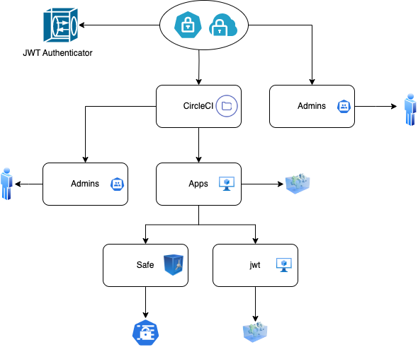

# Conjur policies for CircleCI integration

This demo shows how to integrate CircleCI with CyberArk Conjur using JWT authentication.

## Prerequisites
- Conjur Enterprise or OSS instance running.
- CircleCI project and organization setup.
- JWT Authenticator enabled and configured in Conjur.

## Instructions
1. Load the policy structure into Conjur to establish roles and permissions.
2. Configure the JWT authenticator variables for the CircleCI provider.
3. Use the Conjur orb or direct API calls in `.circleci/config.yml` to retrieve secrets.

The below diagram describes the organization we are loading into Conjur.
