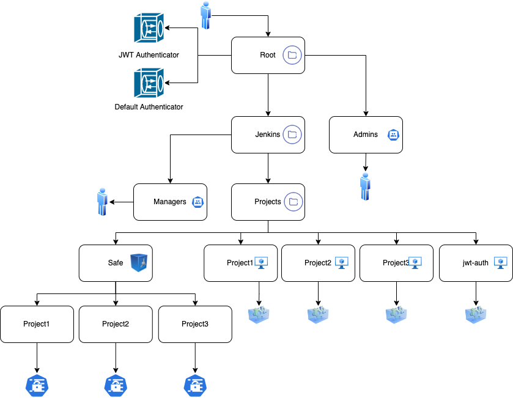

# Conjur policies for Jenkins integration

This demo showcases how to integrate Jenkins with CyberArk Conjur to securely provide secrets to CI/CD pipelines.

## Prerequisites
- Conjur Enterprise or OSS instance running.
- Jenkins server with Conjur plugin installed.
- Conjur CLI configured and authenticated.

## Instructions
1. Load the policies shown in the diagram below to Conjur.
2. Configure the Conjur plugin in Jenkins with the appropriate credentials and Appliance URL.
3. Run a sample pipeline to verify secrets injection.

The below diagram describes the organization we are loading into Conjur.

