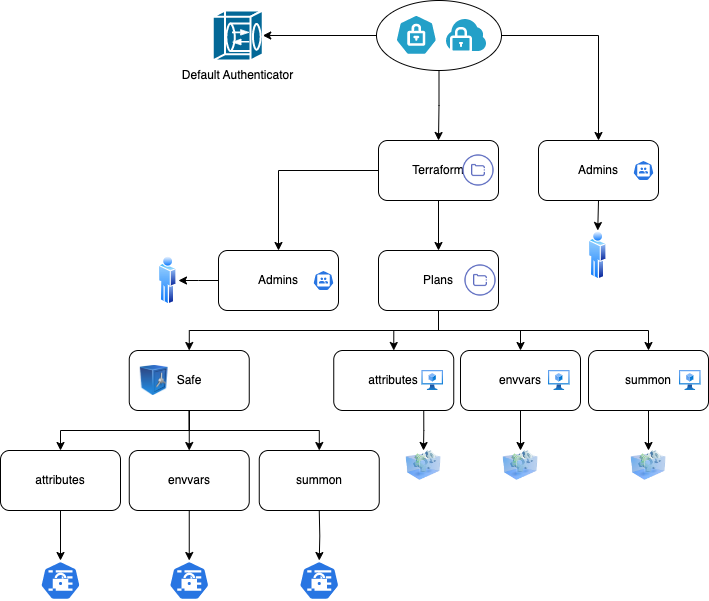

# Conjur policies for Terraform integration

This demo illustrates how to fetch secrets from CyberArk Conjur during Terraform deployments.

## Prerequisites
- Conjur Enterprise or OSS instance running.
- Terraform CLI installed.
- Conjur Provider for Terraform configured.

## Instructions
1. Apply the Conjur policies based on the diagram below.
2. Provide Conjur authentication details to the Terraform provider.
3. Run `terraform init` and `terraform apply` to provision infrastructure with secure secrets.

The below diagram describes the organization we are loading into Conjur.

